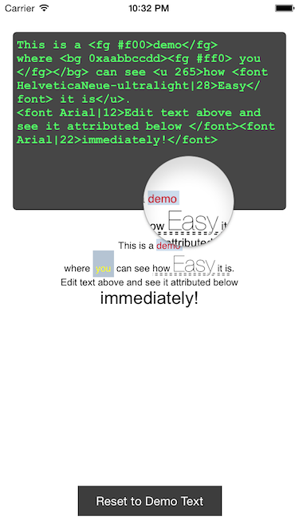

AKAttributeKit (Swift)
======================

Use NSAttributedString with just HTML-like tags. No hassle, just fun!

Tag | Attribute | Example 
 --- | --- | ---
 a | NSLinkAttributeName | `<a http://google.com>Google</a>`
 baseline | NSBaselineOffsetAttributeName | `square<baseline 15>2</baseline>`
 bg | NSBackgroundColorAttributeName | `<bg #00ff00>Green</bg>` or <code>\<bg 255&#124;255&#124;0>Yellow\</bg></code>
 ex | NSExpansionAttributeName | `<ex 5>WIDE</ex>`
 fg | NSForegroundColorAttributeName | `<fg #ff0000>Red</fg>` or <code>\<fg 0&#124;0&#124;255>Blue\</fg></code>
 font | NSFontAttributeName | <code>Different \<font Arial&#124;18>Font\</font></code>
 i | NSObliquenessAttributeName | `<i 0.5>Italic</i>` or `<i 0.8>oblique</i>`
 k | NSKernAttributeName | `<k 20>Huge Space</k>`
 sc, sw | NSStrokeColorAttributeName, NSStrokeWidthAttributeName | `<sc #f00><sw 2>Storked Text</sw></sc>`
 t | NSStrikethroughStyleAttributeName | `<t 1>Wrong</t>`
 u | NSUnderlineStyleAttributeName | `<u 1>Important</u>`
 
Install
-------

Just copy **AshKit** folder to your project. That's it! You are all set :)

Use
----
```swift
var myAttributedText = AKAttributeKit.parseString("My <font Arial|25>big <fg #ff0>yellow</fg></font> text")
// or
myAttributedText = "<t 1>Don't</t> Do it!".toAttributedString()

myLabel.attributedText = myAttributedText
``` 
 
Sneakpeak / Play Around
-----------------------

Run the demo provided to play around with these tags and have a first-hand experience how easy it is!



